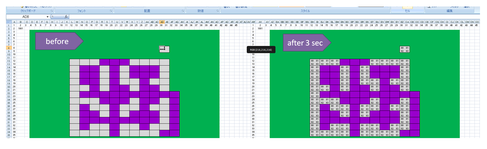

# Excel Worksheet Boosters

**Excel Worksheet Boosters** is a collection of VBA tools that enhance Microsoft Excel worksheets.

The goal of this project is to provide practical worksheet utilities that improve productivity and simplify repetitive tasks. Each toolkit is designed to work independently while sharing a common design philosophy.

---

# MAPBST – Map Booster for Excel

MAPBST is a worksheet-based tile map editor for Microsoft Excel.

Instead of manually entering bitmap numbers, simply paint your map using cell background colors.

MAPBST automatically converts colored cells into bitmap IDs, supports region painting, generates color palettes, restores bitmap numbers, and expands map layouts.

---

## Block Fill

The following example shows the first 45 × 45 map area.

On the left is a worksheet containing only colored cells.

After running **RunBlockFill**, bitmap numbers are automatically generated.



---

## Features

* Automatic 2×2 bitmap placement (Block Fill)
* Region painting based on cell colors (Domino Paint)
* RGB color viewer
* Automatic palette generation
* Bitmap number restoration
* Map layout expansion
* Configurable worksheet-based workflow

---

## Included Sample

The repository includes:

```text
MAPBST/MAPBST_Sample.xlsm
```

The sample workbook intentionally contains only colored cells without bitmap numbers.

This allows you to experience the complete MAPBST workflow from scratch.

---

## Quick Start

Open **MAPBST_Sample.xlsm** and enable VBA macros.

### 1. View RGB Colors

Run:

```text
ShowActiveCellColor
```

Select any colored cell to display its RGB value.

---

### 2. Generate Bitmap Numbers

Run:

```text
RunBlockFill
```

MAPBST searches for valid 2×2 blocks and automatically places bitmap numbers.

---

### 3. Paint Connected Areas

1. Enter a bitmap number into a colored cell.
2. Select that cell.
3. Run:

```text
RunDominoPaint
```

MAPBST fills all connected cells with the same background color.

---

### 4. Generate a Palette

Run:

```text
RunPalette
```

A Palette worksheet is created containing:

* Bitmap IDs
* Color samples
* RGB color values

---

## Project Structure

```text
MAPBST
│
├── MAPBST_Sample.xlsm
├── images
│   └── blockfill-before-after.png
│
├── MAPBST_00_Config.bas
├── MAPBST_10_RGBViewer.bas
├── MAPBST_40_BlockFill.bas
├── MAPBST_50_DominoPaint.bas
├── MAPBST_60_Palette.bas
├── MAPBST_70_MapRestore.bas
├── MAPBST_80_Reset.bas
└── MAPBST_90_Expand.bas
```

---

## Design Philosophy

Traditional tile editors require users to manually place bitmap numbers.

MAPBST follows a different approach.

The worksheet itself becomes the editor.

Users create maps by painting worksheet cells, while MAPBST automatically generates and manages the bitmap numbers.

This keeps the worksheet easy to edit while dramatically reducing manual work.

> **Create maps by painting cells. MAPBST generates the bitmap numbers for you.**

---

## Future Toolkits

MAPBST is the first toolkit included in the **Excel Worksheet Boosters** project.

Additional worksheet productivity tools may be added in the future.

## License

This project is licensed under the MIT License.
See the LICENSE file for details.
